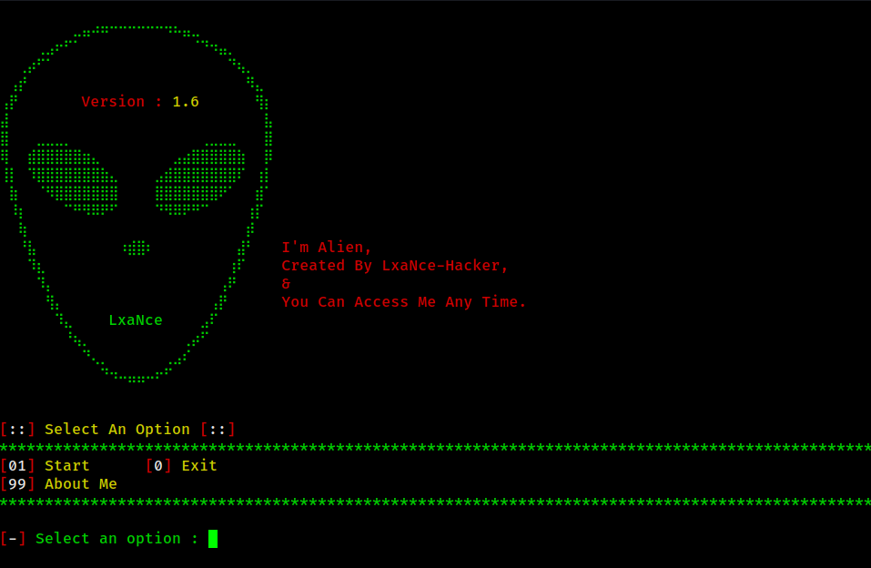

# Alien

**Alien** is an advanced online real-time hosting server designed for seamless and efficient hosting tasks. 🚀

> **Disclaimer:** This tool is created for educational purposes only. Misuse of this tool is strictly prohibited and may lead to legal consequences.

---

<p align="center">
  
</p>

---

## Features

- **Real-time Hosting:** Create and manage hosting servers effortlessly.
- **User-friendly Interface:** Intuitive and easy-to-navigate script.
- **Lightweight & Fast:** Optimized for speed and efficiency.

---

## Installation

To install Alien, follow these simple steps:

```bash
# Clone the repository
$ git clone https://github.com/LxaNce-Hacker/Alien

# Navigate to the Alien directory
$ cd Alien
```

---

## Usage

Get started with Alien in a few steps:

```bash
# Grant execute permissions to the script
$ chmod +x Alien.sh

# Run the Alien script
$ ./Alien.sh
```

---

## Preview

<p align="center">
  
</p>

---

## Contribution

We welcome contributions to enhance Alien! If you have suggestions or find issues, feel free to:

- Open an [issue](https://github.com/LxaNce-Hacker/Alien/issues)
- Submit a pull request

---

## License

This project is licensed under the **GNU License**. See the [LICENSE](LICENSE) file for details.

---

## Connect with Us

Stay updated and connect with us:

- **GitHub:** [LxaNce-Hacker](https://github.com/LxaNce-Hacker)
- **Email:** support@lxance.site

---
